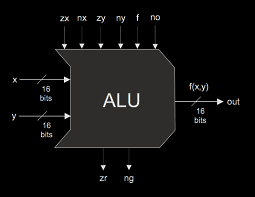

# Nand2Tetris
Working my way through the <a name="" href="https://www.nand2tetris.org/">Nand2Tetris </a> project &amp; understanding the inner workings of a computer.

This project is from the course [nand2tetris](https://www.nand2tetris.org/). From building logic gates to writing a high level language and an operating system in it, the resultant is a modern-day 16-bit computer which I have documented below. 

<text>Building a Modern Computer From First Principles.</text>

<h2>Project Outcome</h2>
<ol type="1">
  <li>Bare bones hardware - The _Hack_ computer</li>
  <li>Assembly language - The _Hack_ assembly</li>
  <li>Virtual machine - The _Jack Virtual Machine_ (JVM)</li>
  <li>High level language - The _Jack_ programming language</li>
  <li>Operating System - The _Jack_ OS</li>
</ol> 

## Table of Contents
1. [Hardware](#hardware) 
	- [Logic Gates](#logic-gates)
	- [ALU](#alu)
	- [Registers, RAM, and PC](#registers-ram-and-pc)
2. [Architecture](#architecture)
	- [Instruction Set](#instruction-set)
		- [The A-instruction](#the-a-instruction)
 		- [The C-instruction](#the-c-instruction)
	- [Memory](#memory)
	- [CPU](#cpu)
	- [Computer](#computer)
4. [Assembler](#assembler)
5. [Jack Virtual Machine](#jack-virtual-machine)
	- [The Stack](#the-stack)
	- [Program Control](#program-control)
	- [JVM and Hack](#jvm-and-hack)
6. [Compiler](#compiler)
	- [High Level Language](#high-level-language)
	- [Syntax Analysis](#syntax-analysis)
	- [Code Generation](#code-generation)
7. [Operating System](#operating-system)

# Hardware
This section aims at building the bare-bones of the computer. We first make simple logic gates and then leverage them to further make more sophisticated hardware. The logic is written in a custom Hardware Description Language (HDL) specified [here](https://docs.wixstatic.com/ugd/44046b_2cc5aac034ae49f4bf1650a3d31df32c.pdf).

## Logic Gates
All the logic gates are created from the primitive Nand gate. Here are a list of gates that were implemented.

## Primary
<table>
	<tr>
		<th><a href="./projects/01/Nand2.hdl">Nand</a>
		</th>
		<th><a href="./projects/01/Nor.hdl">Nor</a>
		</th>
		<th><a href="./projects/01/Not.hdl">Not</a>
		</th>
		<th><a href="./projects/01/And.hdl">And</a>
		</th>
		<th><a href="./projects/01/Or.hdl">Or</a>
		</th>
		<th><a href="./projects/01/Xor.hdl">Xor</a>
		</th>
		<th><a href="./projects/01/Xnor.hdl">Xnor</a>
		</th>
	</tr>
	<tr>
		<td>
		</td>
		<td>
		</td>
		<td>
		</td>
		<td>
		</td>
		<td>
		</td>
		<td>
		</td>
		<td>
		</td>
	</tr>
</table>

## Advanced

<table>
	<tr>
		<th><a href="./projects/01/Mux.hdl">Mux</a></th>
		<th><a href="./projects/01/DMux.hdl">DMux</a></th>
	</tr>
	<tr>
		<td></td>
		<td></td>
	</tr>
		
</table>

## 16-bit wide gates

- [Not16](./projects/01/Not16.hdl)
- [And16](./projects/01/And16.hdl)
- [Or16](./projects/01/Or16.hdl) 
- [Mux16](./projects/01/Mux16.hdl)

## Or(x0,...,x7)

- [Or8Way](./projects/01/Or8Way.hdl)

## 16-bit wide with 4/8 inputs
- [Mux4Way16](./projects/01/Mux4Way16.hdl) 
- [Mux8Way16](./projects/01/Mux8Way16.hdl)
- [DMux4Way16](./projects/01/DMux4Way16.hdl)
- [DMux8Way16](./projects/01/DMux8Way16.hdl)

## ALU
This ALU can compute eighteen functions using some minimal hardware design. It uses 6 control bits where each bit refers to a certain elementary operation.

|control-bit|description|
|---|---|
|zx|zero the x input?|
|nx|negate the x input?|
|zy|zero the y input?|
|ny|negate the y input?|
|f|compute x+y (if 1) or x&y (if 0)|
|no|negate the output?|

The following functions can be computed with the control bits as follows:

#|zx|nx|zy|ny|f|no|f(x,y)
---|---|---|---|---|---|---|---
1|1|0|1|0|1|0|0
2|1|1|1|1|1|1|1
3|1|1|1|0|1|0|-1
4|0|0|1|1|0|0|x
5|1|1|0|0|0|0|y
6|0|0|1|1|0|1|!x
7|1|1|0|0|0|1|!y
8|0|0|1|1|1|1|-x
9|1|1|0|0|1|1|-y
10|0|1|1|1|1|1|x+1
11|1|1|0|1|1|1|y+1
12|0|0|1|1|1|0|x-1
13|1|1|0|0|1|0|y-1
14|0|0|0|0|1|0|x+y
15|0|1|0|0|1|1|x-y
16|0|0|0|1|1|1|y-x
17|0|0|0|0|0|0|x&y
18|0|1|0|1|0|1|x\|y

The ALU also produces two status bits with the output.

|status-bit|description|
|---|---|
|zr|is the output zero?|
|ng|is the output negative?|

The following chips were implemented in this section
* [HalfAdder](./projects/02/HalfAdder.hdl), [FullAdder](./projects/02/FullAdder.hdl)
* [Add16](./projects/02/Add16.hdl), [Inc16](./projects/02/Inc16.hdl)
* [ALU](./projects/02/ALU.hdl)

**Future work**: It will be better to replace the naive ripple carry adder in Add16 with a more efficient one like a carry-lookahead adder.

## Registers, RAM and PC
Storage is realized using Data Flip-Flops (DFFs). Registers are 16-bit wide and are composed of DFFs. These registers are further stacked to create the random access memory (RAM). It allows reading/writing data from/to any address in constant time, irrespective of the physical location.

Finally, a program counter is also realized using a 16-bit register which has the following functions - reset to zero, load a particular value, and increment the current value.

List of chips implemented
* [Bit](./projects/03/a/Bit.hdl), [Register](./projects/03/a/Register.hdl)
* [RAM8](./projects/03/a/RAM8.hdl), [RAM64](./projects/03/a/RAM64.hdl), [RAM512](./projects/03/b/RAM512.hdl), [RAM4K](./projects/03/b/RAM4K.hdl), [RAM16K](./projects/03/b/16K.hdl)
* [PC](./projects/03/a/PC.hdl)

https://github.com/shubham1172/nand2tetris/blob/master/README.md
